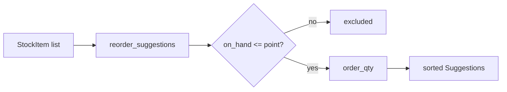

# Reorder suggestions: design record

## 1. Context and users

## 2. Requirements

| ID | Requirement |
|---|---|
| R1 | Reorder point = daily_usage x lead_days + safety_stock |
| R2 | Items above their reorder point are not suggested |
| R3 | order_qty = point + 7 days of usage - on hand; zero quantities are not suggested |
| R4 | Items whose arithmetic overflows are skipped, never wrapped |

## 3. Architecture

## 4. Interface (I/O specification)

| Item | Type | Range / unit | Notes |
|---|---|---|---|
| | | | |

## 5. Requirement trace

| Requirement | Code location | Test name | Result |
|---|---|---|---|
| R1 | | | |
| R2 | | | |
| R3 | | | |
| R4 | | | |

## 6. Design decision record

Decision:
Alternatives considered:
Consequences:

## 7. AI assistance and review

| Section drafted by AI | What I verified | What I changed |
|---|---|---|

## 8. Known limits and maintenance notes
